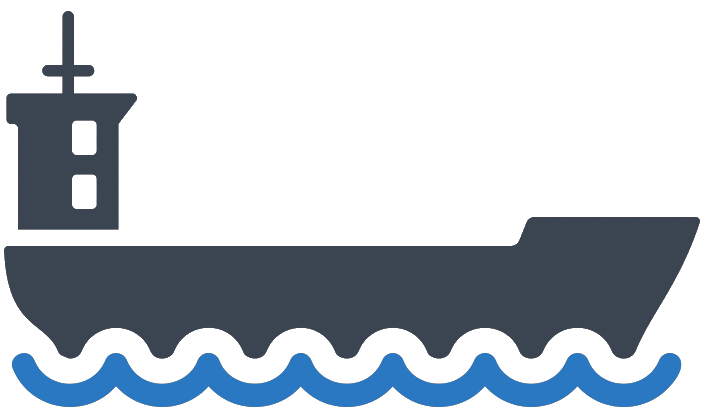

:title: Hovercraft! demo
:data-transition-duration: 1500
:css: hovercraft.css

----

Presentation Title
========================

Presenter Name

----

:data-y: r1000

Outline
=========

* Section 1
* Section 2
* Section 3

.. note::

    If you have more notes than fit in the console, you can scroll down, but
    more handily, you can scroll the text up by pressing space bar.

----

:data-rotate: 90

Section 1
============

test

foobar

.. note::

   If there isn't more text to scroll up, space bar will go to the next
   slide. Therefore you, as a presenter, just press space every time you run
   out of things to say!

----

:data-x: r0
:data-y: r500
:data-scale: 0.1

Let's Zoom In
================

Discuss some details here

.. note::

    Zooming is cool. But one day it will grow old as well. What will we do
    then to make presentations interesting?

----

:data-x: r-800
:data-scale: 1

Zoom out again
==================

Back to normal

.. note::

    It's probably back to making bad jokes again.

----

:id: ThreeD
:data-y: r1200
:data-rotate-x: 180

Flip in 3D
====================

*But...*

.. note::

    Wow! 3D! You didn't see that one coming, did you?

----

:id: thequestion
:data-x: r0
:data-y: r-1200

Where to go from here?
=======================

Let's see on the next slide!

.. note::

    What would be the point of this slide show if I didn't have a solution?
    Duh!

----

:data-rotate-y: 180
:data-scale: 3
:data-x: r-2500
:data-y: r0

Introducing **My Awesome Tool**
================================

.. note::

    TADA!

----

:data-x: 0
:data-y: 2500
:data-z: 4000
:data-rotate-x: 90

**Conclusion**
===============

To be added

.. note::

    Fork and contribute!
